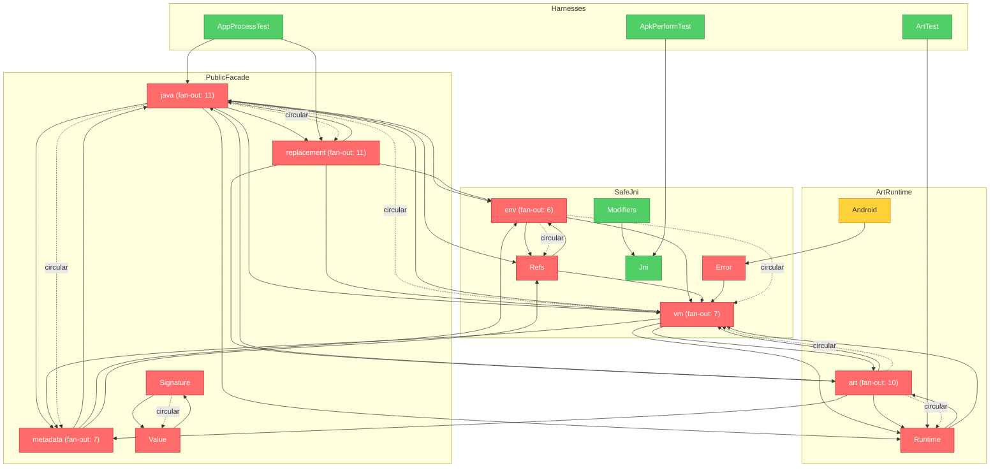

# Brooks-Lint Review

**Mode:** Tech Debt Assessment  
**Scope:** entire project  
**Health Score:** 54/100  
**Trend:** First Tech Debt Assessment run, no prior debt baseline.

This crate has strong safety intent and unusually honest capability boundaries, but several core bridge decisions now live in large change-magnet modules where duplication and procedural ART knowledge make future Android/runtime changes expensive.

## Findings

### 🔴 Critical

**Knowledge Duplication — Java value coercion has drifted**
Status: Handled. Shared descriptor-directed coercion now lives in [src/coercion.rs](/home/skrimix/work/frida/frida-java-bridge-rs/src/coercion.rs:9), with call/field mapping in [src/java/args.rs](/home/skrimix/work/frida/frida-java-bridge-rs/src/java/args.rs:889) and hook-return mapping in [src/replacement/api.rs](/home/skrimix/work/frida/frida-java-bridge-rs/src/replacement/api.rs:1308). The double-to-float non-finite hook-return behavior was tightened and covered by tests. Verification passed with `just host-test`, `just check`, and `just unit-test-build`.
Symptom: Numeric coercion exists in both call/field argument preparation in [src/java/args.rs](/home/skrimix/work/frida/frida-java-bridge-rs/src/java/args.rs:931) and hook-return conversion in [src/replacement/api.rs](/home/skrimix/work/frida/frida-java-bridge-rs/src/replacement/api.rs:1307). The duplicated double-to-float rule has already diverged: argument coercion rejects non-finite values, while hook returns only reject finite out-of-range values at [src/replacement/api.rs](/home/skrimix/work/frida/frida-java-bridge-rs/src/replacement/api.rs:2064).  
Source: The Pragmatic Programmer — DRY; Ousterhout — Information Leakage.  
Consequence: Every conversion rule change must be synchronized across calls, fields, overload dispatch, and replacement returns; missed updates become boundary bugs.  
Remedy: Extract one descriptor-directed coercion module with shared int narrowing and float checks, then map its typed errors into call/field/hook-specific errors.

**Change Propagation — Replacement facade is a core change magnet**
Status: In progress. Hook return ownership, conversion, and return validation have been extracted into [src/replacement/returns.rs](/home/skrimix/work/frida/frida-java-bridge-rs/src/replacement/returns.rs:1), hook argument inspection/conversion has been extracted into [src/replacement/arguments.rs](/home/skrimix/work/frida/frida-java-bridge-rs/src/replacement/arguments.rs:1), and hook installation/admission has been extracted into [src/replacement/install.rs](/home/skrimix/work/frida/frida-java-bridge-rs/src/replacement/install.rs:1). Public exports stay stable through [src/replacement/mod.rs](/home/skrimix/work/frida/frida-java-bridge-rs/src/replacement/mod.rs:22), while [src/replacement/api.rs](/home/skrimix/work/frida/frida-java-bridge-rs/src/replacement/api.rs:1) now owns the public guard/context facade. Verification passed with `cargo fmt --check`, `just host-test`, `just check`, `just unit-test-build`, and `just test all` on connected SDK 34 after the install extraction.
Symptom: [src/replacement/api.rs](/home/skrimix/work/frida/frida-java-bridge-rs/src/replacement/api.rs:33) contains public guard/context types, context inspection, return conversion, argument conversion, hook installation, constructor rules, ABI validation, and helper errors in one 2,538-line module.  
Source: Fowler — Divergent Change; Ousterhout — Deep vs Shallow Modules.  
Consequence: Adding one hook capability forces edits through unrelated public API, conversion, validation, and lifecycle areas, raising regression risk in the most dangerous subsystem.  
Remedy: Split by responsibility: `context`, `arguments`, `returns`, `install`, and `constructor` modules, keeping `api.rs` as a narrow public re-export or facade.

### 🟡 Warning

**Cognitive Overload — Live runtime harnesses are megascripts**
Symptom: `run_replacement_checks` starts at [src/app_process_test/replacement_checks.rs](/home/skrimix/work/frida/frida-java-bridge-rs/src/app_process_test/replacement_checks.rs:5) and spans about 2,065 lines; `check_app_loader_surface` starts at [src/app_process_test/checks.rs](/home/skrimix/work/frida/frida-java-bridge-rs/src/app_process_test/checks.rs:767) and spans about 1,096 lines.  
Source: Fowler — Long Method; McConnell — High-Quality Routines.  
Consequence: Failures are harder to localize, adding a focused scenario means editing a broad script, and unrelated fixture/setup concerns are easy to entangle.  
Remedy: Preserve the harness but split scenario groups into small behavior-named checks with shared fixture builders and assertion helpers.

**Dependency Disorder — `ArtBackend` is too many capability boundaries at once**
Symptom: [src/art/backend.rs](/home/skrimix/work/frida/frida-java-bridge-rs/src/art/backend.rs:83) stores dozens of optional ART symbols/capabilities, while [from_module](/home/skrimix/work/frida/frida-java-bridge-rs/src/art/backend.rs:153), method replacement, enumeration, deoptimization, runnable-thread handling, and support probing all hang off the same type.  
Source: Clean Architecture — SRP/ISP; Brooks — Conceptual Integrity.  
Consequence: New ART support broadens a central object instead of a bounded capability, and tests must fake an increasingly large backend surface.  
Remedy: Introduce typed support structs such as `ArtSymbols`, `EnumerationSupport`, `ReplacementSupport`, and `DeoptimizationSupport`, each owning its prerequisites and probe result.

**Accidental Complexity — ART layout probing is procedural knowledge**
Symptom: Runtime and method layout detection rely on named constants plus scan windows and API heuristics in [src/art/layout.rs](/home/skrimix/work/frida/frida-java-bridge-rs/src/art/layout.rs:233) and [src/art/runtime_layout.rs](/home/skrimix/work/frida/frida-java-bridge-rs/src/art/runtime_layout.rs:151). This complexity is justified, but the evidence model is implicit in loops.  
Source: Ousterhout — Information Hiding; McConnell — Magic Numbers.  
Consequence: Supporting a new Android API requires re-deriving which offsets, predicates, and fallback reasons belong together.  
Remedy: Move versioned offset candidates and predicate evidence into named data structures, with tests per API family and feature.

### 🟢 Suggestion

**Accidental Complexity — Argument trait impl surface is hard to predict**
Symptom: [src/java/args.rs](/home/skrimix/work/frida/frida-java-bridge-rs/src/java/args.rs:250) uses tuple macros, blanket `Into<JavaValue>` impls, string/reference special cases, field-value variants, and sealed marker impls in one module.  
Source: Fowler — Speculative Generality; Ousterhout — Interface Complexity.  
Consequence: The API is ergonomic, but maintainers must reason through overlapping trait paths before changing argument behavior.  
Remedy: Keep the ergonomics, but group impl families into submodules and add a short internal decision table documenting precedence.

## Debt Summary

| Risk | Findings | Avg Priority | Classification | Intent |
|---|---:|---:|---|---|
| Cognitive Overload | 1 | 6.0 | Scheduled debt | accidental |
| Change Propagation | 1 | 9.0 | Critical debt | accidental |
| Knowledge Duplication | 1 | 9.0 | Critical debt | accidental |
| Accidental Complexity | 2 | 3.5 | Monitored/Scheduled debt | accidental |
| Dependency Disorder | 1 | 6.0 | Scheduled debt | accidental |
| Domain Model Distortion | 0 | 0.0 | None | n/a |

**Recommended focus:** Java value coercion has been unified, and the replacement facade split has started to pay down the largest change magnet. Continue with the remaining replacement context/constructor split before the next wave of ART/runtime features.

## Summary

The codebase is not careless; it is carrying real complexity from Android ART, JNI ownership, and safe replacement boundaries. The debt worth paying down first is where that complexity is repeated or concentrated: shared conversion rules, replacement facade responsibilities, and large runtime harness scripts.

I also appended this baseline to [.brooks-lint-history.json](/home/skrimix/work/frida/frida-java-bridge-rs/.brooks-lint-history.json:12) and validated the JSON with `jq`. No build or runtime tests were run for this read-only assessment.

# Brooks-Lint Review

**Mode:** Architecture Audit  
**Scope:** Entire project: `src/` core crate, Android harness modules, examples and fixtures sampled for boundary context  
**Health Score:** 64/100  
**Trend:** First run - no trend data

The crate has a strong conceptual architecture, but its implementation graph has collapsed into one large core cycle around `art`, `vm`, `java`, `replacement`, `metadata`, `env`, and `refs`.

---

## Module Dependency Graph

---

## Findings

### 🔴 Critical

**Dependency Disorder — Core Modules Form One Strongly Connected Component**  
Symptom: The top-level dependency scan found one large cycle containing `art`, `runtime`, `vm`, `java`, `metadata`, `replacement`, `env`, `refs`, `error`, `signature`, and `value`. Concrete back-edges include [src/runtime.rs](/home/skrimix/work/frida/frida-java-bridge-rs/src/runtime.rs:9) importing `art` and `vm`, [src/vm.rs](/home/skrimix/work/frida/frida-java-bridge-rs/src/vm.rs:7) importing `art`, `env`, `java`, `metadata`, and `runtime`, [src/art/backend.rs](/home/skrimix/work/frida/frida-java-bridge-rs/src/art/backend.rs:25) importing `java` and `metadata`, and [src/error.rs](/home/skrimix/work/frida/frida-java-bridge-rs/src/error.rs:10) depending on `Vm`.  
Source: Clean Architecture — Acyclic Dependencies Principle / Dependency Inversion Principle; The Mythical Man-Month — Conceptual Integrity.  
Consequence: Layer changes cannot be reasoned about independently. A change to error ownership, Java wrappers, ART probing, method replacement, or metadata can force coordinated edits and retesting across the whole Android core.  
Remedy: Establish one explicit dependency direction: raw `jni`/descriptor/value/error primitives at the bottom, a narrow VM attachment kernel above that, ART internals returning raw records or backend DTOs, and `java`/`replacement` translating those into public wrappers. Break cycles first at `error -> vm`, `env <-> refs`, `java <-> metadata`, and `java <-> replacement`.

### 🟡 Warning

**Dependency Disorder — ART Backend Depends On Facade Types**  
Symptom: The low-level ART module imports high-level wrapper concepts such as `ClassLoaderRef`, `JavaObject`, `java::raw`, and `metadata` in [src/art/backend.rs](/home/skrimix/work/frida/frida-java-bridge-rs/src/art/backend.rs:25), and its enumeration APIs return facade-facing values like `Vec<ClassLoaderRef>`, `Vec<raw::Class>`, and `Vec<metadata::JavaMethodQueryGroup>` at [src/art/backend.rs](/home/skrimix/work/frida/frida-java-bridge-rs/src/art/backend.rs:243).  
Source: Clean Architecture — Dependency Inversion Principle / Stable Dependencies Principle.  
Consequence: ART probing and mutation cannot evolve as an infrastructure layer without dragging the public Java facade with it. This also makes Android-version-specific internals harder to test or replace behind a small adapter.  
Remedy: Have `art` return ART-owned raw records such as loader handles, class handles, and raw method-query groups; translate those into `ClassLoaderRef`, `raw::Class`, and metadata in `java` or a dedicated adapter module.

**Change Propagation — `Vm` Has Become Both Kernel And Feature Router**  
Symptom: `Vm` owns thread attachment and raw JNI access, but also dispatches capabilities, class-loader enumeration, class enumeration, method queries, heap choosing, method replacement, and deoptimization through [src/vm.rs](/home/skrimix/work/frida/frida-java-bridge-rs/src/vm.rs:145). Its imports pull in `art`, `env`, `java`, `metadata`, and `runtime` at [src/vm.rs](/home/skrimix/work/frida/frida-java-bridge-rs/src/vm.rs:7).  
Source: Refactoring — Divergent Change; A Philosophy of Software Design — Information Leakage.  
Consequence: New runtime features naturally accumulate on `Vm`, so a change to the JNI attachment boundary can affect facade behavior and ART feature routing.  
Remedy: Keep `Vm` focused on raw VM ownership, attachment, and JNI invocation-table access. Move feature routing to `Java`, `ArtBackend`, or a separate `RuntimeFeatures` facade that depends on `Vm`, not the other way around.

**Change Propagation — Runtime Construction Has No Replaceable ART Boundary**  
Symptom: `Runtime::obtain()` directly enumerates process modules, resolves `JNI_GetCreatedJavaVMs`, constructs `ArtBackend::from_module`, and stores the concrete backend in `RuntimeInner` at [src/runtime.rs](/home/skrimix/work/frida/frida-java-bridge-rs/src/runtime.rs:88). Unit tests rely on `Vm::dangling_for_tests()` and `ArtBackend::empty_for_tests()` at [src/vm.rs](/home/skrimix/work/frida/frida-java-bridge-rs/src/vm.rs:214).  
Source: Working Effectively with Legacy Code — The Seam Model.  
Consequence: Unsupported-path tests are possible, but successful ART behavior, cleanup behavior, and translation behavior mostly require live Android harnesses. That raises the cost of changing runtime discovery or backend feature checks.  
Remedy: Introduce a small injectable backend seam, for example an `ArtOps` or `RuntimeBackend` trait, and let the concrete `ArtBackend` be the production adapter. Keep the live Android harnesses for integration confidence, but make routing and error behavior host-testable.

**Accidental Complexity — Facade Modules Are Carrying Multiple Architectural Roles**  
Symptom: `java/mod.rs` defines the public coordinator, class-loader model, raw submodule, global perform/main-thread state, and many reexports in one module starting at [src/java/mod.rs](/home/skrimix/work/frida/frida-java-bridge-rs/src/java/mod.rs:39). `art/backend.rs` combines symbol resolution state, capability checks, enumeration, heap choosing, and method replacement orchestration in one 1000+ line backend.  
Source: A Philosophy of Software Design — Deep vs. Shallow Modules; Code Complete — Managing Complexity.  
Consequence: New contributors have to understand several levels of abstraction before knowing where a behavior belongs, which makes future work more likely to add another back-edge instead of a cleaner boundary.  
Remedy: Split by responsibility rather than file size alone: move `java::raw` to a real module, isolate perform/main-thread state from wrapper APIs, and separate ART symbol/capability state from enumeration and replacement orchestration.

### 🟢 Suggestion

**Knowledge Duplication — Descriptor-To-Name Conversion Exists Twice**  
Symptom: `class_name_from_descriptor` is implemented in both [src/art/enumeration.rs](/home/skrimix/work/frida/frida-java-bridge-rs/src/art/enumeration.rs:176) and [src/metadata/reflection.rs](/home/skrimix/work/frida/frida-java-bridge-rs/src/metadata/reflection.rs:436) with the same slash-to-dot conversion logic.  
Source: The Pragmatic Programmer — DRY; A Philosophy of Software Design — Information Leakage.  
Consequence: Public naming rules for arrays and object descriptors can drift between ART enumeration and reflection metadata.  
Remedy: Move descriptor/name conversion into one descriptor helper module, likely near `signature`, and have both ART and metadata call that helper.

---

## Summary

The most important repair is to break the core strongly connected component before adding more ART features. The current names and safety posture are good for an experimental pre-1.0 crate, but the dependency direction needs to become explicit soon or every new capability will make the architecture harder to test and change.

I also recorded this Brooks-Lint run in [.brooks-lint-history.json](/home/skrimix/work/frida/frida-java-bridge-rs/.brooks-lint-history.json:1).
