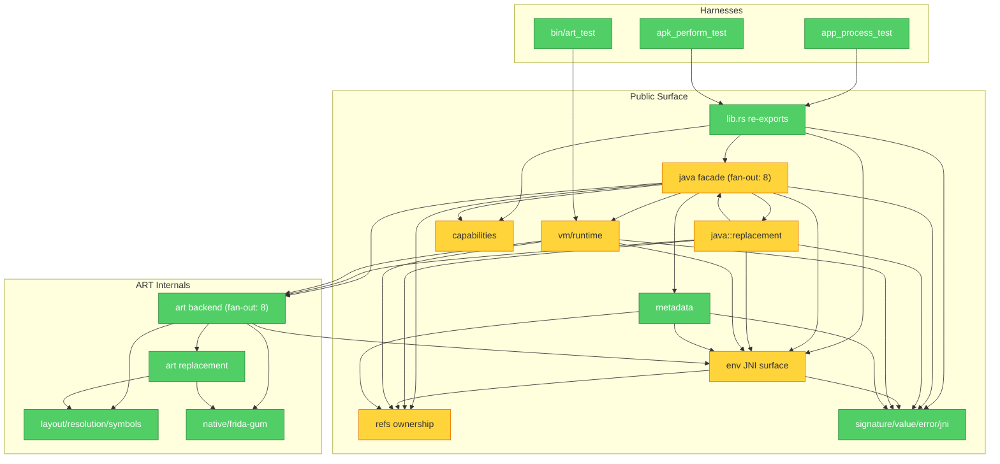

# Brooks-Lint Review

**Mode:** Tech Debt Assessment  
**Scope:** Entire project by auto-scope detection: `src/`, app/APK harnesses, public facade, ART internals, and docs sampled  
**Health Score:** 75/100

Overall verdict: the crate has a valuable safety goal, but too much of the first implementation grew as broad facade surface and parallel conversion machinery before the current use cases demanded it.

## Findings

### 🔴 Critical

**Change Propagation — Java value handling is spread across too many parallel surfaces**

Symptom: The same “how does a Rust value become Java, and how does Java become Rust?” decision is expressed separately in call args, field values, normal returns, hook args, and hook returns: [src/java/args/call.rs](/home/skrimix/work/frida/frida-java-bridge-rs/src/java/args/call.rs:3), [src/java/args/field.rs](/home/skrimix/work/frida/frida-java-bridge-rs/src/java/args/field.rs:3), [src/java/returns.rs](/home/skrimix/work/frida/frida-java-bridge-rs/src/java/returns.rs:41), [src/java/replacement/arguments.rs](/home/skrimix/work/frida/frida-java-bridge-rs/src/java/replacement/arguments.rs:47), and [src/java/replacement/returns.rs](/home/skrimix/work/frida/frida-java-bridge-rs/src/java/replacement/returns.rs:60).  
Source: Fowler — Shotgun Surgery; The Pragmatic Programmer — Orthogonality / DRY.  
Consequence: Adding or correcting one Java type/reference behavior can require edits in 5+ modules, which makes small semantic fixes feel risky and invites drift between “normal call” and “replacement hook” behavior. Priority 9: critical debt, accidental.  
Remedy: Pick one canonical conversion path for primitive/reference/string/null handling, then make call, field, and hook APIs thin adapters around it. Keep this boring and local; do not build a new framework.

### 🟡 Warning

**Accidental Complexity — Replacement facade has too many equivalent ways to do the same thing**

Symptom: `JavaHookContext` previously exposed duplicate original-call aliases for pass-through, current-argument forwarding, typed return extraction, and object/array/void convenience extraction in one public surface: [src/java/replacement/context.rs](/home/skrimix/work/frida/frida-java-bridge-rs/src/java/replacement/context.rs:126). Constructor hooks mirrored part of that through forwarding methods and an initialization token: [src/java/replacement/constructor.rs](/home/skrimix/work/frida/frida-java-bridge-rs/src/java/replacement/constructor.rs:42).  
Source: Fowler — Speculative Generality / Middle Man; Ousterhout — Shallow Module.  
Consequence: The API looks safe but harder to learn than it needs to be; maintainers must preserve many aliases, docs, and tests for behavior that could be expressed through one or two clear paths. Priority 6: scheduled debt, accidental.  
Remedy: Collapse aliases first. Keep `ret`, one original-call path, one raw escape hatch, and constructor initialization safety; remove convenience methods only when examples can stay readable without them.

**Cognitive Overload — `ArtBackend` is a symbol registry, capability checker, and feature executor at once**

Symptom: `ArtBackend` stores dozens of optional ART symbols and feature states in one struct: [src/art/backend.rs](/home/skrimix/work/frida/frida-java-bridge-rs/src/art/backend.rs:79), resolves them all in one constructor: [src/art/backend.rs](/home/skrimix/work/frida/frida-java-bridge-rs/src/art/backend.rs:149), and implements class-loader enumeration, class enumeration, method query, heap enumeration, and replacement in the same file: [src/art/backend.rs](/home/skrimix/work/frida/frida-java-bridge-rs/src/art/backend.rs:239).  
Source: McConnell — High-Quality Routines; Brooks — Conceptual Integrity.  
Consequence: A contributor touching one ART capability must mentally load unrelated capabilities and their optional symbol rules, which slows fixes and increases accidental coupling. Priority 6: scheduled debt, accidental.  
Remedy: Start with the most active cluster, probably method replacement, and move only its symbol checks and execution helpers behind a small feature-local struct or helper module. Leave the rest alone until a second cluster shows the same pain.

**Knowledge Duplication — JNI primitive slot knowledge is repeated in several forms**

Symptom: JNI function types live in [src/jni.rs](/home/skrimix/work/frida/frida-java-bridge-rs/src/jni.rs:164), slot constants in [src/jni.rs](/home/skrimix/work/frida/frida-java-bridge-rs/src/jni.rs:295), primitive call macro entries in [src/env/calls.rs](/home/skrimix/work/frida/frida-java-bridge-rs/src/env/calls.rs:80), and primitive field macro entries in [src/env/fields.rs](/home/skrimix/work/frida/frida-java-bridge-rs/src/env/fields.rs:57). Some duplication is inherent to JNI, but this repeats the same type/slot/operation decision across unsafe boundaries.  
Source: The Pragmatic Programmer — DRY; Ousterhout — Information Leakage.  
Consequence: A slot/type mismatch would compile and fail at runtime inside unsafe JNI calls, so maintenance relies on manual audit discipline. Priority 4: scheduled debt, accidental.  
Remedy: Keep the explicit audit table, but make each primitive operation family state the slot/type pair once and generate the wrapper from that. Add small tests that assert slot/name/type pairings for the table.

**Domain Model Distortion — Test failures are modeled as unsupported runtime features**

Symptom: App-process assertions return `Error::UnsupportedFeature` for ordinary test mismatches: [src/app_process_test/assertions.rs](/home/skrimix/work/frida/frida-java-bridge-rs/src/app_process_test/assertions.rs:186). The APK harness does the same for callback count, loader, thread, and value assertions: [src/apk_perform_test.rs](/home/skrimix/work/frida/frida-java-bridge-rs/src/apk_perform_test.rs:45).  
Source: Evans — Ubiquitous Language; Code Complete — Error-Handling Discipline.  
Consequence: The project’s important “supported vs unsupported with reason” language gets diluted; a regression can look like a capability limitation. Priority 4: scheduled debt, accidental.  
Remedy: Introduce a tiny test-only failure path, or return plain harness strings for assertion failures. Reserve `UnsupportedFeature` for intentional capability limits and probed ART gaps.

## Debt Summary

| Risk | Findings | Avg Priority | Classification | Intent |
|------|----------|--------------|----------------|--------|
| Cognitive Overload | 1 | 6.0 | Scheduled | accidental |
| Change Propagation | 1 | 9.0 | Critical | accidental |
| Knowledge Duplication | 1 | 4.0 | Scheduled | accidental |
| Accidental Complexity | 1 | 6.0 | Scheduled | accidental |
| Dependency Disorder | 0 | 0.0 | Monitored | n/a |
| Domain Model Distortion | 1 | 4.0 | Scheduled | accidental |

**Recommended focus:** simplify Java value conversion first, then prune the replacement facade. Those two moves directly address the overengineering pressure without requiring a sweeping redesign.

## Summary

The most important cleanup is to make value/reference conversion a single maintained decision instead of a family of parallel implementations. The second is to reduce public hook API breadth before it hardens into accidental compatibility.

---

# Brooks-Lint Review

**Mode:** Architecture Audit  
**Scope:** entire project: `src/`, manifests, `.agents` docs, examples/test harness structure  
**Health Score:** 78/100  
**Trend:** First run, no prior architecture-audit history

The architecture has a sensible safety gradient overall, but the early overengineering is visible in the `java` facade, replacement stack, capability plumbing, and process-global state.

---

## Module Dependency Graph

---

## Findings

### 🟡 Warning

**Dependency Disorder — Parent-module preludes hide real dependency flow**  
Symptom: `src/java/mod.rs` imports most core concepts at once and several child files start with `use super::*`; `src/env/mod.rs` does the same for every env leaf module. See [src/java/mod.rs](/home/skrimix/work/frida/frida-java-bridge-rs/src/java/mod.rs:39), [src/env/mod.rs](/home/skrimix/work/frida/frida-java-bridge-rs/src/env/mod.rs:26), and [src/java/wrapper.rs](/home/skrimix/work/frida/frida-java-bridge-rs/src/java/wrapper.rs:1).  
Source: Clean Architecture — Acyclic Dependencies Principle; Ousterhout — Information Leakage.  
Consequence: small changes to the parent module can silently affect many leaf modules, and reviewers cannot tell what a file actually depends on from its header.  
Remedy: as files are touched, replace `use super::*` with explicit imports and move concrete type definitions closer to their behavior modules while keeping `mod.rs` as the re-export surface.

**Accidental Complexity — Replacement path is split more finely than the current backend needs**  
Symptom: `java::replacement` declares twelve submodules for one closure-backed ART replacement path, and [src/java/replacement/backend.rs](/home/skrimix/work/frida/frida-java-bridge-rs/src/java/replacement/backend.rs:5) mostly wraps `ArtMethodReplacementGuard` plus three nearly identical resolver functions.  
Source: Fowler — Speculative Generality / Middle Man; Brooks — Second-System Effect.  
Consequence: changing replacement behavior requires hopping through `targets`, `install`, `closure`, `backend`, `original_call`, `returns`, and ART internals even when the current change is one concrete path.  
Remedy: flatten the trivial Java replacement backend wrapper into the closure/install path, and replace the three trampoline resolver functions with one small resolver helper keyed by `MethodKind`.

**Change Propagation — Capability knowledge is scattered across public, facade, and backend modules**  
Symptom: the public capability shape is in [src/capabilities.rs](/home/skrimix/work/frida/frida-java-bridge-rs/src/capabilities.rs:8), assembled in [src/java/handle.rs](/home/skrimix/work/frida/frida-java-bridge-rs/src/java/handle.rs:87), with ART checks in [src/art/capabilities.rs](/home/skrimix/work/frida/frida-java-bridge-rs/src/art/capabilities.rs:15), deoptimization checks elsewhere, and perform/main-thread checks in `java`.  
Source: Hunt & Thomas — DRY; Ousterhout — Information Leakage.  
Consequence: adding or renaming one supported capability becomes a coordinated edit across unrelated areas and docs, increasing the chance that status reporting drifts from behavior.  
Remedy: keep the flat `JavaCapabilities` struct, but make each feature expose one local support function next to the feature action and extract only tiny repeated prerequisite helpers such as `unsupported_arm64_only`.

**Testability Seam — Process-global state is becoming the default integration point**  
Symptom: `APP_PERFORM_STATE` and `MAIN_THREAD_STATE` are process-global `OnceLock`s in [src/java/mod.rs](/home/skrimix/work/frida/frida-java-bridge-rs/src/java/mod.rs:106), with similar global replacement controller state in ART replacement internals.  
Source: Feathers — The Seam Model.  
Consequence: behavior around app startup, main-thread scheduling, and replacement lifecycle is forced toward app-process tests even when parts of the queue/drain logic could be tested as ordinary state machines.  
Remedy: keep globals only as composition roots, but make the underlying state structs directly constructible in unit tests; avoid adding more globals for new features unless Android process identity truly requires it.

### 🟢 Suggestion

**Cognitive Overload — The Java facade’s data model and behavior are split awkwardly**  
Symptom: [src/java/mod.rs](/home/skrimix/work/frida/frida-java-bridge-rs/src/java/mod.rs:137) declares most public Java wrapper types, while [src/java/wrapper.rs](/home/skrimix/work/frida/frida-java-bridge-rs/src/java/wrapper.rs:149) holds a 2,209-line implementation cluster for classes, methods, fields, bound objects, and display helpers.  
Source: McConnell — High-Quality Routines; Ousterhout — Deep Modules.  
Consequence: a maintainer adding one wrapper operation must mentally join type definitions, dispatch helpers, metadata lookup, and return conversion across multiple files.  
Remedy: move only the currently touched impl blocks into their natural modules, for example class behavior into `class.rs` and object behavior into `object.rs`; avoid a large “reorganize everything” pass.

**Accidental Complexity — `ArtBackend` is a central symbol bag for many independent ART features**  
Symptom: [src/art/backend.rs](/home/skrimix/work/frida/frida-java-bridge-rs/src/art/backend.rs:79) stores dozens of optional symbols and controllers for enumeration, deoptimization, replacement, debugger hooks, runtime layout, and runnable-thread support.  
Source: Fowler — Divergent Change; Ousterhout — Strategic vs. Tactical Programming.  
Consequence: every ART feature tends to add fields and checks to the same hub, which raises merge pressure and makes it harder to see the minimum prerequisites for one feature.  
Remedy: keep `ArtBackend` as the single internal facade, but group only already-cohesive data around present features, not a generic plugin/backend framework.

---

## Summary

No critical architecture failure showed up: the main safety direction is still coherent, with public Java APIs above `Env`/`Vm` and ART mutation kept internal. The biggest cleanup priority is to flatten and make dependencies explicit, especially in `java`, `env`, and `java::replacement`; that matches the new anti-overengineering rule better than adding fresh abstraction layers.

## Remediation Progress

| Status | Finding | Notes |
|--------|---------|-------|
| Done | Change Propagation — Java value handling is spread across too many parallel surfaces | Centralized call, field, and hook-return value coercion/preparation in `src/java/conversion.rs`; hook Rust string returns now follow the same string-compatible descriptor rule as calls and fields. |
| Done | Accidental Complexity — Replacement facade has too many equivalent ways to do the same thing | Removed duplicate original-call aliases from `JavaHookContext`, kept `call_original` plus the unsafe raw escape hatch, and made current-argument forwarding go through `call_original(ctx.args())`; constructor replacement now keeps only the explicit initialization-token original-call path. |
| Open | Cognitive Overload — `ArtBackend` is a symbol registry, capability checker, and feature executor at once | Not started. |
| Open | Knowledge Duplication — JNI primitive slot knowledge is repeated in several forms | Not started. |
| Open | Domain Model Distortion — Test failures are modeled as unsupported runtime features | Not started. |
| Open | Dependency Disorder — Parent-module preludes hide real dependency flow | Not started. |
| Open | Accidental Complexity — Replacement path is split more finely than the current backend needs | Not started. |
| Open | Change Propagation — Capability knowledge is scattered across public, facade, and backend modules | Not started. |
| Open | Testability Seam — Process-global state is becoming the default integration point | Not started. |
| Open | Cognitive Overload — The Java facade’s data model and behavior are split awkwardly | Not started. |
| Open | Accidental Complexity — `ArtBackend` is a central symbol bag for many independent ART features | Not started. |
