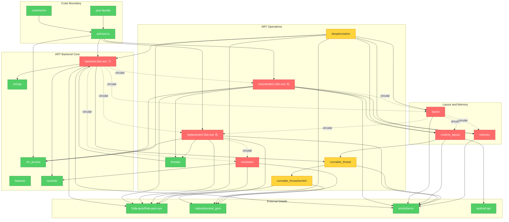

# Brooks-Lint Review

**Mode:** Architecture Audit  
**Scope:** `src/art/` (16 production Rust files plus `src/art/tests.rs` sampled for seams)  
**Health Score:** 75/100  

`src/art` has a coherent ART-backend purpose, but its core modules are starting to form a knot around layout probing, symbol resolution, enumeration, and replacement.

---

## Module Dependency Graph

---

## Findings

### 🔴 Critical

**Dependency Disorder — ART layout, replacement, enumeration, and resolution are cyclic**

Symptom: `layout` imports `enumeration`, `replacement`, `runtime_layout`, and `memory` in [src/art/layout.rs](/home/skrimix/work/frida/frida-java-bridge-rs/src/art/layout.rs:3), while those modules also depend back on `layout` or each other: `runtime_layout` imports `layout::*` in [src/art/runtime_layout.rs](/home/skrimix/work/frida/frida-java-bridge-rs/src/art/runtime_layout.rs:3), `replacement` imports `layout::*` and `resolution` in [src/art/replacement.rs](/home/skrimix/work/frida/frida-java-bridge-rs/src/art/replacement.rs:20), `enumeration` imports `layout::*` in [src/art/enumeration.rs](/home/skrimix/work/frida/frida-java-bridge-rs/src/art/enumeration.rs:10), and `resolution` imports replacement-owned GC synchronization types in [src/art/resolution.rs](/home/skrimix/work/frida/frida-java-bridge-rs/src/art/resolution.rs:5).  
Source: Clean Architecture — Acyclic Dependencies Principle (ADP)  
Consequence: Any change to ART method layout, trampoline probing, or symbol discovery can require touching unrelated operation modules, and it becomes hard to test or reason about layout code without pulling in replacement and enumeration behavior.  
Remedy: Make `layout` a leaf for ART structs, constants, raw readers, and pure layout decisions. Move operation-specific helpers out of `layout`: replacement cloning/patch helpers should live in `replacement`, class lookup helpers should live in `enumeration`, and shared unsupported-feature helpers should live in a small neutral module such as `features` or `support`.
Status: Done — `layout` no longer imports enumeration, replacement, backend operation symbol types, or runtime-layout unsupported-feature helpers. Enumeration owns method-query class lookup, replacement owns method patch/clone helpers, `features` owns unsupported-feature helpers, and `ArtModuleRange` now lives with layout data.

### 🟡 Warning

**Cognitive Overload — operation modules mix orchestration, probing, raw mutation, and conversion**

Symptom: The three largest operation files are doing several architectural jobs at once: `replacement.rs` is 1419 lines and includes public backend entrypoints, hook installation, replacement mapping, original-call bypass state, method cloning, and thunk writing; `enumeration.rs` is 1385 lines and includes class-loader enumeration, class enumeration, method query grouping, heap instance selection, fake handle scopes, and metadata conversion; `deoptimization.rs` is 933 lines and includes support probing, JDWP setup, socket handling, interceptor replacement, instrumentation offsets, and ARM64 relocation helpers. Concrete examples are `replace_method` coordinating layout detection, hook installation, thread transition, cloning, patching, and guard construction in [src/art/replacement.rs](/home/skrimix/work/frida/frida-java-bridge-rs/src/art/replacement.rs:59), and `enumerate_methods` combining JNI probes, ART layout discovery, query matching, callback wiring, and cleanup in [src/art/enumeration.rs](/home/skrimix/work/frida/frida-java-bridge-rs/src/art/enumeration.rs:975).  
Source: A Philosophy of Software Design — Deep Modules; Code Complete — High-Quality Routines  
Consequence: A maintainer working on one ART capability has to keep too many unrelated details in mind, which raises the chance of breaking replacement while changing layout probing, or breaking heap enumeration while adjusting method query behavior.  
Remedy: Split only along existing real responsibilities, not speculative layers: keep `ArtBackend` entrypoints thin, move replacement hook/controller code into a replacement submodule, move replacement patch/clone logic out of `layout`, and split enumeration into class loaders, loaded classes, methods, heap instances, and handle-scope support if those areas keep changing independently.
Status: Partial — replacement lifecycle code is now split into private submodules for controller mappings, hooks, guard/rollback, ArtMethod cloning/patching, original-call bypass state, and dispatch thunks. Enumeration and deoptimization still need their own responsibility splits.

**Change Propagation / Testability Seam — Gum hook state is process-global and reached directly**

Symptom: `ArtVmAccess` is a good VM seam in [src/art/vm_access.rs](/home/skrimix/work/frida/frida-java-bridge-rs/src/art/vm_access.rs:5), and many layout functions accept `MemoryRanges`, but replacement and deoptimization still obtain Gum process state directly through `Interceptor::obtain(crate::native::process_gum())` in [src/art/replacement.rs](/home/skrimix/work/frida/frida-java-bridge-rs/src/art/replacement.rs:552), [src/art/replacement.rs](/home/skrimix/work/frida/frida-java-bridge-rs/src/art/replacement.rs:744), and [src/art/deoptimization.rs](/home/skrimix/work/frida/frida-java-bridge-rs/src/art/deoptimization.rs:502), with process-global atomics/locks such as `ART_REPLACEMENT_CONTROLLER` and `JDWP_RECEIVE_CLIENT_FD` in [src/art/replacement.rs](/home/skrimix/work/frida/frida-java-bridge-rs/src/art/replacement.rs:43) and [src/art/deoptimization.rs](/home/skrimix/work/frida/frida-java-bridge-rs/src/art/deoptimization.rs:35).  
Source: Working Effectively with Legacy Code — The Seam Model  
Consequence: Hook lifecycle behavior is hard to characterize without a live Gum/ART process, and failures around listener installation, reversion, or global state ordering can escape host tests.  
Remedy: Introduce one narrow hook-installation seam at the call sites that already install/revert Gum hooks. Keep it simple: a small internal trait or function-parameter adapter for attach/replace/revert is enough; avoid a broad framework.
Status: Open — this pass intentionally left Gum process-state access unchanged; replacement hook code only moved into `src/art/replacement/hooks.rs`.

---

# Brooks-Lint Review

**Mode:** Tech Debt Assessment  
**Scope:** `src/art/` (17 files, 9,716 LOC; no `.brooks-lint.yaml` found)  
**Health Score:** 69/100  

Overall verdict: the ART layer is coherent and intentionally low-level, but too much volatile runtime knowledge is concentrated in a few broad files and repeated across feature paths.

---

## Findings

### 🟡 Warning

**Cognitive Overload — Core ART flows mix too many responsibilities**  
Symptom: Large routines combine support checks, ART layout probing, raw pointer validation, runtime mutation, hook setup, and rollback logic in one path, especially [replacement.rs](/home/skrimix/work/frida/frida-java-bridge-rs/src/art/replacement.rs:59), [replacement.rs](/home/skrimix/work/frida/frida-java-bridge-rs/src/art/replacement.rs:214), [enumeration.rs](/home/skrimix/work/frida/frida-java-bridge-rs/src/art/enumeration.rs:975), and [runnable_thread/arm64.rs](/home/skrimix/work/frida/frida-java-bridge-rs/src/art/runnable_thread/arm64.rs:147).  
Source: Fowler — Refactoring — Long Method; McConnell — Code Complete — High-Quality Routines  
Consequence: Changes to one ART behavior require re-reading a full runtime workflow, which raises the chance of missing a rollback, support check, or pointer validity constraint.  
Remedy: Split only the obvious phases into local helpers: prerequisites, candidate selection, mutation, registration, and cleanup. Keep helpers private and feature-specific.
Status: Partial — method replacement now has lifecycle submodules, but replacement orchestration still has a broad `replace_method` flow and enumeration plus runnable-thread paths remain unchanged.

**Knowledge Duplication — ART layout facts live in multiple places**  
Symptom: Runtime offsets, thread field derivation, method layout scans, ClassLinker trampoline assumptions, and APEX/version logic are encoded separately in [runtime_layout.rs](/home/skrimix/work/frida/frida-java-bridge-rs/src/art/runtime_layout.rs:183), [runtime_layout.rs](/home/skrimix/work/frida/frida-java-bridge-rs/src/art/runtime_layout.rs:314), [layout.rs](/home/skrimix/work/frida/frida-java-bridge-rs/src/art/layout.rs:523), [layout.rs](/home/skrimix/work/frida/frida-java-bridge-rs/src/art/layout.rs:799), [runnable_thread.rs](/home/skrimix/work/frida/frida-java-bridge-rs/src/art/runnable_thread.rs:170), and [deoptimization.rs](/home/skrimix/work/frida/frida-java-bridge-rs/src/art/deoptimization.rs:642).  
Source: Hunt & Thomas — The Pragmatic Programmer — DRY; Ousterhout — A Philosophy of Software Design — Information Leakage  
Consequence: Android ART layout changes can leave one probe updated and another stale, producing device-specific failures that are hard to diagnose.  
Remedy: Centralize only repeated derived facts, starting with “find JNIEnv in ArtThread” and API/APEX layout thresholds.
Status: Partial — ArtThread/JNIEnv offset detection is now shared by managed-stack probing, runnable-thread exception probing, and fake handle-scope probing. API/APEX threshold ownership and other ART layout facts still need follow-up cleanup.

**Accidental Complexity — Replacement lifecycle is a small subsystem in one file**  
Symptom: [replacement.rs](/home/skrimix/work/frida/frida-java-bridge-rs/src/art/replacement.rs:43) combines process-global bypass state, controller maps, hook installation, GC synchronization, method cloning, guard rollback, and dispatch thunk generation.  
Source: Ousterhout — A Philosophy of Software Design — Tactical Programming; Fowler — Refactoring — Divergent Change  
Consequence: The file has several reasons to change: Gum hook behavior, ART patch state, dispatch assembly, rollback policy, and original-call handling. A fix in one area can accidentally disturb another.  
Remedy: Move the existing code into small private submodules by lifecycle concern: mappings, hooks, guard/rollback, and dispatch thunk. Do not introduce a new framework.
Status: Done — `src/art/replacement.rs` is now the orchestration root with private lifecycle submodules for controller mappings, Gum hooks, guard rollback, method clone/patch helpers, original-call bypass state, and dispatch thunk generation.

**Dependency Disorder — `ArtBackend` is both registry and feature surface**  
Symptom: [backend.rs](/home/skrimix/work/frida/frida-java-bridge-rs/src/art/backend.rs:65) owns symbol groups and shared controller state, while `enumeration.rs`, `replacement.rs`, and `deoptimization.rs` implement feature behavior on `ArtBackend`; `layout.rs` also imports backend feature enums and enumeration visitors.  
Source: Martin — Clean Architecture — Stable Dependencies Principle; Brooks — The Mythical Man-Month — Conceptual Integrity  
Consequence: The module boundary is harder to reason about: backend state, feature operations, and layout probing depend on each other in several directions.  
Remedy: Keep `ArtBackend` as the resolved-runtime state holder, but let feature modules own their feature-specific symbol structs and support checks.
Status: Done — ArtBackend remains the resolved runtime state holder, while enumeration/heap and deoptimization now own their feature-specific symbol structs, type aliases, and resolver construction. Shared ART symbols remain in backend only when used across feature boundaries.

**Domain Model Distortion — Raw pointers erase ART roles**  
Symptom: Core ART concepts are mostly `*mut c_void`, `usize`, and `HashMap<usize, ...>` in [layout.rs](/home/skrimix/work/frida/frida-java-bridge-rs/src/art/layout.rs:38), [replacement.rs](/home/skrimix/work/frida/frida-java-bridge-rs/src/art/replacement.rs:337), and dispatch thunk APIs like [replacement.rs](/home/skrimix/work/frida/frida-java-bridge-rs/src/art/replacement.rs:1114).  
Source: Fowler — Refactoring — Primitive Obsession; Evans — Domain-Driven Design — Ubiquitous Language  
Consequence: Callers must remember whether each integer is an ArtMethod, replacement method, JNI ID, PC, thread pointer, or code address. That makes invalid cross-use easy during future changes.  
Remedy: Add minimal newtypes only for repeated high-risk roles, such as `ArtMethodPtr`, `ArtThreadPtr`, and `CodeAddress`, with no behavior beyond naming and null/address conversion.
Status: Open — this pass preserved existing raw pointer and address types.

### 🟢 Suggestion

**Knowledge Duplication — The ART test harness repeats byte-layout fixture setup**  
Symptom: [tests.rs](/home/skrimix/work/frida/frida-java-bridge-rs/src/art/tests.rs:616) repeatedly builds synthetic ART methods, class linker memory, runtime layouts, and executable ranges with raw byte vectors and copied offsets.  
Source: Fowler — Refactoring — Duplicate Code; Meszaros — xUnit Test Patterns — Test Code Duplication  
Consequence: New layout tests are likely to copy another fixture block, and a fixture convention can drift silently across cases.  
Remedy: Add tiny fixture builders for the most repeated layouts, but keep individual test scenarios explicit.
Status: Open — this pass did not change test fixture setup.
